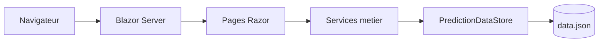

# Architecture simplifiée

ParisMarket est une application Blazor Server simple. L'objectif est de séparer l'interface, les règles métier et les données sans créer trop de couches inutiles.

## Vue d'ensemble

## Responsabilites

| Zone | Role | Exemples |
| --- | --- | --- |
| `Pages/` | Interface et interactions utilisateur | accueil, création, résultats |
| `Shared/` | Composants communs | layout, barre de progression |
| `backend/` | Domaine et règles métier | prédictions, votes, utilisateurs |
| `wwwroot/` | Assets statiques | CSS, JS, images |
| `docs/` | Notes d'explication | architecture, soutenance |

## Flux de vote

1. L'utilisateur choisit un profil de démonstration.
2. La page d'accueil appelle `PredictionService.Vote`.
3. Le service charge `data.json` via `PredictionDataStore`.
4. Les règles métier valident la prédiction, l'utilisateur, la date limite et l'absence de vote précédent.
5. Le vote est ajouté puis le fichier JSON est sauvegardé.

## Choix techniques principaux

- **Blazor Server** : permet de construire l'interface avec C# et Razor.
- **Stockage JSON** : suffisant pour une démonstration scolaire et facile à inspecter.
- **Services métier** : centralisent les règles importantes comme le double vote ou la clôture.
- **Tests simples** : valident les règles principales sans ajouter de framework de test.

## Limites connues

- Pas d'authentification réelle.
- Le fichier `data.json` n'est pas adapté à une production avec plusieurs utilisateurs simultanés.
- Les utilisateurs sont des comptes de démonstration.
- Certains anciens fichiers HTML/CSS à la racine ressemblent à des prototypes et pourront être rangés plus tard.
